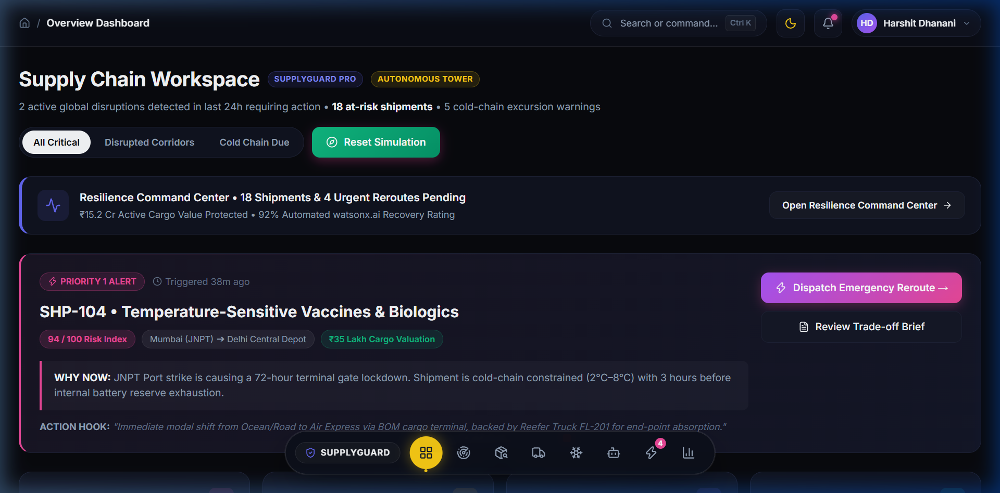
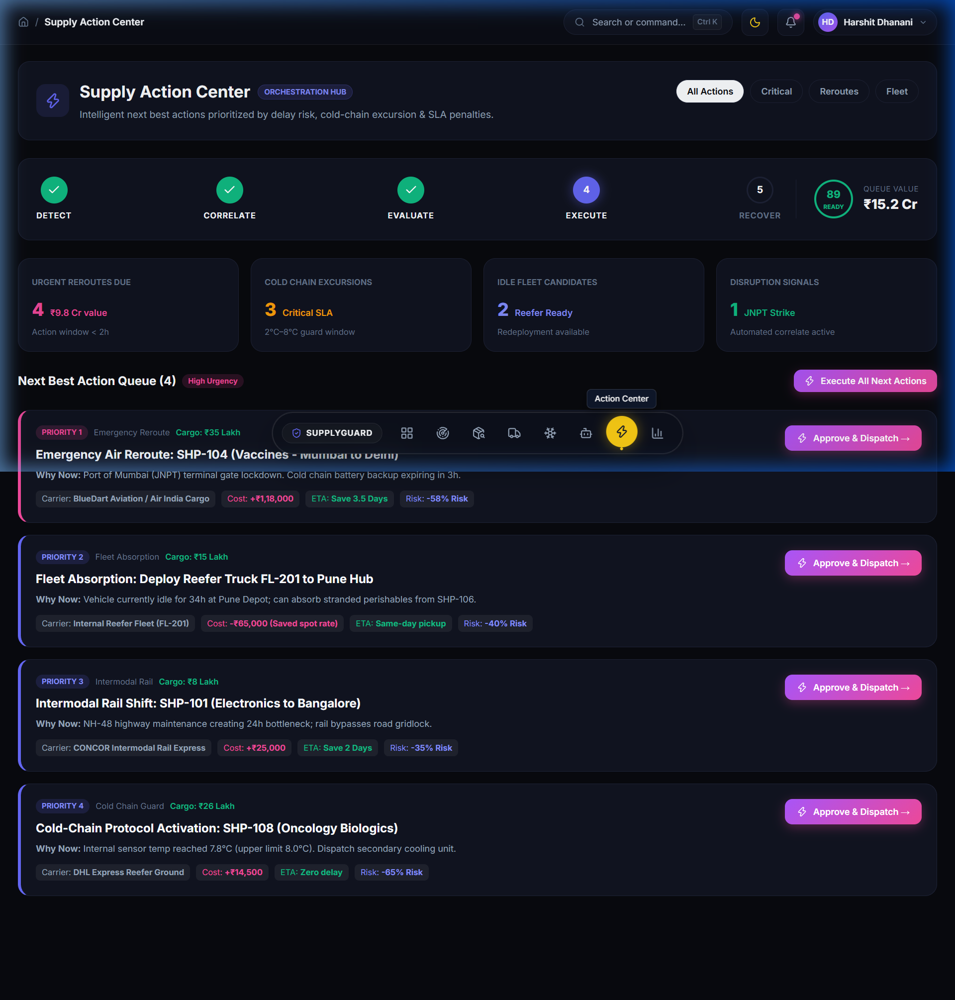
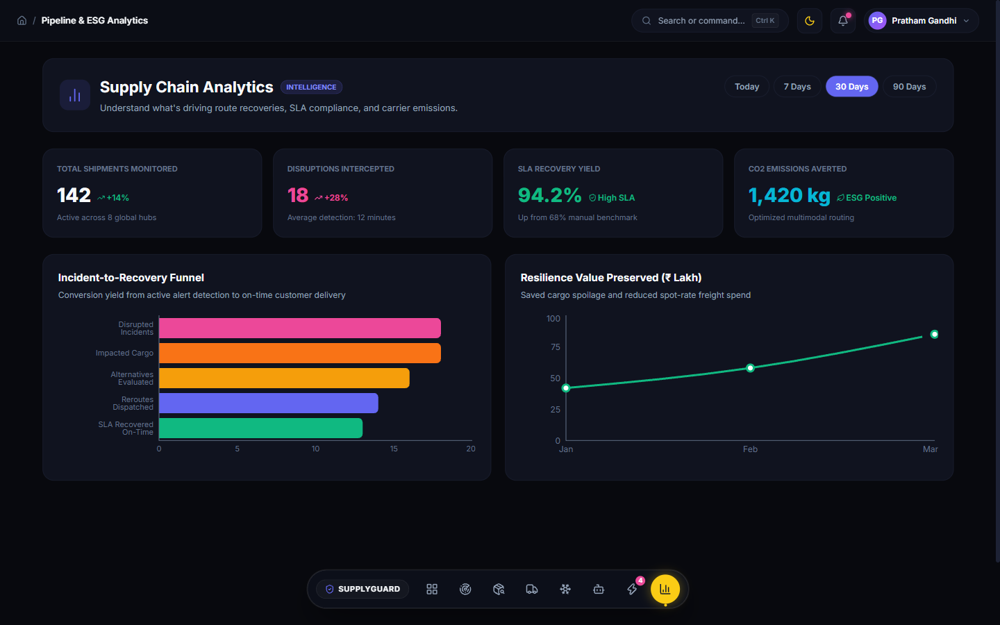
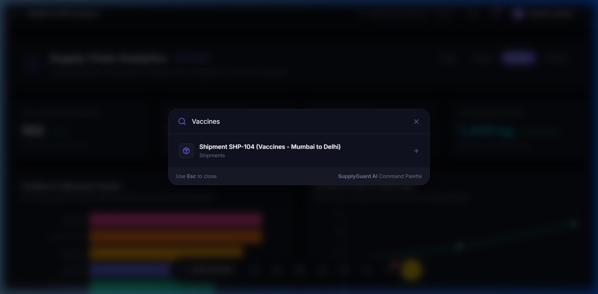
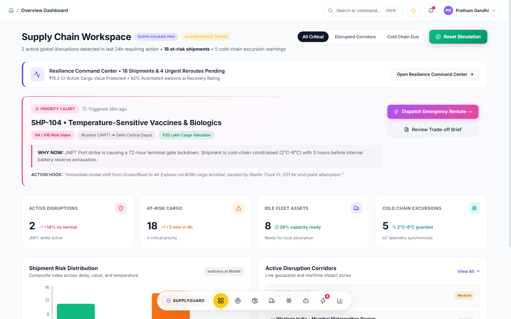

# 🚢 SupplyGuard AI — Autonomous Supply Chain Control Tower & Fleet Optimizer

[](https://github.com/hars-star/bob-ai-hackathon-cosmo-coders)
[](docs/problem-statement.md)
[](src/backend)
[](src/frontend)
[](https://www.ibm.com/watsonx)
[](src/backend/tests)

> **Autonomous Disruption Correlation, Multi-Objective Pareto Rerouting, Dynamic Fleet Optimization, and Cold-Chain Compliance Monitoring Powered by IBM watsonx.ai.**

---

## 👥 Team Cosmo Coders

| Field | Value |
| :--- | :--- |
| **Team Name** | **Cosmo Coders** |
| **Hackathon Track** | **AI** (Problem L2 — Supply Chain Disruption Assistant & Fleet Utilisation Optimizer) |
| **Team Lead** | **Harshit Dhanani** — [hrdhanani2117@gmail.com](mailto:hrdhanani2117@gmail.com) |
| **Team Members** | Harshit Dhanani,Pratham Gandhi ,pratik Agarwal and Dhairya Shah  |
| **Repository** | [github.com/hars-star/bob-ai-hackathon-cosmo-coders](https://github.com/hars-star/bob-ai-hackathon-cosmo-coders) |

---

## 🎯 Problem Statement

Global supply chains lose over **$184 billion annually** to unanticipated port closures, geopolitical chokepoint restrictions, and extreme weather events. When disruptions strike, enterprise logistics managers spend **6 to 18 hours** manually cross-referencing news alerts with freight manifests. Emergency rerouting decisions are made blindly without transparency into mathematical trade-offs between freight costs, transit delay, risk, and CO2 emissions. Concurrently, regional freight fleets operate with significant idle capacity, and up to **50% of temperature-sensitive vaccines and pharmaceuticals are spoiled** due to unmonitored cold-chain excursions.

---

## 💡 Solution: SupplyGuard AI

**SupplyGuard AI** is an intelligent, full-stack Supply Chain Control Tower that shifts logistics management from reactive firefighting to automated resilience:

1. **Automated Disruption Correlation**: Geospatially maps port strikes, storms, and chokepoints against active multimodal shipments in real time.
2. **Multi-Objective Rerouting Engine**: Evaluates air, ocean, and rail carrier alternatives using Pareto-optimal trade-offs across **Cost Delta ($), Delay Variance (Days), Risk Index (0-100), and CO2 Emissions (kg)**.
3. **Dynamic Fleet Utilization Optimizer**: Identifies idle regional fleet assets (dry vans, reefer trucks) to absorb incoming rerouted cargo, minimizing third-party spot freight costs.
4. **Cold Chain IoT Compliance Guard**: Continuous telemetry tracking (temperature, humidity, battery) with automated thermal excursion detection and spoilage risk warnings.
5. **watsonx.ai Supply Chain Copilot**: Interactive conversational assistant powered by IBM watsonx.ai foundation models, translating operational data into executive summaries and structured action playbooks.

---

## 🖼️ Application Preview

| Overview Control Tower (Dark Mode) | Supply Action Center & Stepper |
| :---: | :---: |
|  |  |
| **Pipeline & ESG Analytics** | **Command Palette Search (Ctrl+K)** |
|  |  |
| **Overview Control Tower (Light Mode)** | |
|  | |

---

## ✨ Key Features

- **🌐 Real-Time Disruption Matrix**: Ingests disruption incidents (e.g., JNPT Mumbai strike, Red Sea avoidance, storm warnings) and automatically correlates affected corridors with in-transit shipments.
- **⚡ Supply Action Center**: Modeled after modern enterprise orchestration hubs with a 5-stage pipeline stepper (`DETECT ➔ CORRELATE ➔ EVALUATE ➔ EXECUTE ➔ RECOVER`) and 1-click execution queues.
- **🧭 Floating Dock Navigation**: Centered macOS-style floating dock with status indicator dots, badges, and instant tooltips.
- **🌓 Dark & Light Theme System**: Complete theme personalization with high-contrast dark mode and clean modern light mode.
- **⚖️ Pareto-Optimal Reroute Trade-offs**: Unlike traditional single-factor algorithms, SupplyGuard AI displays transparent multi-dimensional trade-offs for each carrier option (e.g. Express Air vs Intermodal Rail vs Alternate Ocean).
- **🚛 Fleet Capacity Absorption**: Recommends nearby idle internal trucks to absorb stranded cargo, slashing deadhead miles and third-party spot rates.
- **❄️ Sensitive Cargo & Cold Chain Guard**: Visualizes historical sensor telemetry curves against strict temperature guardrails (e.g., 2°C–8°C for pharma biologics) with automatic excursion flagging.
- **⚡ One-Click Disruption Simulation**: Dispatchers can simulate new disruptions on-the-fly and immediately observe system-wide risk propagation and recovery recommendations.
- **🤖 watsonx.ai Conversational Assistant**: Answers natural language questions, diagnoses critical shipments, and delivers structured recovery action steps with dual-mode fallback resilience.

---

## 🛠️ Tech Stack

| Category | Technologies |
| :--- | :--- |
| **Backend API** | Python 3.10+, FastAPI, Uvicorn, Pydantic v2 |
| **AI / LLM** | IBM watsonx.ai (`ibm-watsonx-ai`, `ibm/granite-13b-instruct-v2`), Intelligent Domain Fallback |
| **Frontend UI** | React 18, Vite, Custom Glassmorphic Dark Design System, Tailwind Tokens |
| **Data Visualization** | Recharts (Responsive Line & Bar Charts), Lucide React Icons |
| **Database & Engine** | SQLite 3 Relational DB, Pandas DataFrames, Automated CSV Seeder |
| **Testing & Quality** | Pytest, FastAPI TestClient, HTTPX |

---

## 🏗️ System Architecture

```mermaid
flowchart TD
    subgraph Data Layer
        A[(SQLite DB)] <--> B[Shipments, Disruptions, Fleet, Telemetry Data]
    end

    subgraph Backend Engine (FastAPI)
        C[Disruption Engine] --> D[Multi-Objective Rerouting Engine]
        C --> E[Risk Scoring Engine]
        F[Cold Chain Guard] --> G[Sensor Analysis]
        H[Fleet Optimizer] --> I[Asset Reallocation]
        J[watsonx.ai Integration Service] --> K[Operational Copilot]
    end

    subgraph Frontend Control Tower (React + Vite)
        L[Overview Dashboard]
        M[Disruptions Matrix]
        N[Shipments & Rerouting]
        O[Fleet Utilization]
        P[Cold Chain Telemetry]
        Q[AI Copilot Interface]
    end

    A --> Backend
    Backend -->|REST API| Frontend
```

---

## ⚡ Quickstart & Setup

### 1. Clone the Repository
```bash
git clone https://github.com/hars-star/bob-ai-hackathon-cosmo-coders.git
cd bob-ai-hackathon-cosmo-coders
```

### 2. Launch Backend
```bash
cd src/backend
python -m venv venv
# On Windows: .\venv\Scripts\Activate.ps1 | On Unix: source venv/bin/activate
pip install -r requirements.txt
python -m uvicorn app.main:app --reload --host 127.0.0.1 --port 8000
```
*The database automatically creates and seeds itself with multimodal shipment, disruption, and fleet records.*
- **Interactive Swagger Docs**: `http://127.0.0.1:8000/docs`
- **Health Check**: `http://127.0.0.1:8000/api/health`

### 3. Launch Frontend
```bash
cd src/frontend
npm install
npm run dev
```
- Open browser to **`http://localhost:5173`**

### 4. Run Automated Tests
```bash
pytest src/backend/tests/ -v
# 10 passed in 0.42s (100% pass rate)
```

---

## 📁 Repository Structure

```
bob-ai-hackathon-cosmo-coders/
├── .github/                  # GitHub workflow configurations
├── demo/                     # Demo deliverables
│   ├── screenshots/          # 7 High-resolution screenshots of all views
│   ├── demo-video-link.txt   # Video presentation link
│   └── live-demo-url.txt     # Local & hosted URL instructions
├── docs/                     # Comprehensive hackathon documentation
│   ├── architecture.md       # Full architecture diagram & data flows
│   ├── problem-statement.md  # Domain problem & impact analysis
│   ├── setup-guide.md        # Step-by-step setup and verification
│   └── solution-overview.md  # Detailed feature description & IBM tech
├── presentation/             # Presentation materials
│   └── README.md             # 8-slide presentation script & outline
├── src/                      # Complete source code
│   ├── backend/              # FastAPI application, database & services
│   └── frontend/             # React 18 single-page application
├── submission.yaml           # Automated hackathon evaluation metadata
└── README.md                 # Project master document
```

---

## 🏅 What We're Most Proud Of

1. **True Multi-Objective Decision Transparency**: Logistics decisions are never black-and-white. Our Rerouting Engine gives dispatchers instant mathematical visibility into Cost, Delay, Risk, and Carbon footprint simultaneously.
2. **Zero-Config Developer & Judge Experience**: The entire stack boots in under 60 seconds with auto-seeded relational data and zero external setup hurdles.
3. **Resilient Dual-Mode AI**: Enterprise operations cannot afford downtime. Our architecture delivers intelligent watsonx.ai foundation model reasoning with a zero-downtime domain heuristic fallback.

---

## ⚠️ Known Limitations

- Uses realistic synthetic datasets and SQLite for the hackathon environment; production enterprise deployment would stream live AIS marine satellite and IoT MQTT feeds into Kafka/TimescaleDB.
- Third-party carrier booking APIs are modeled as simulations rather than executing real-world EDI/API financial transactions.
