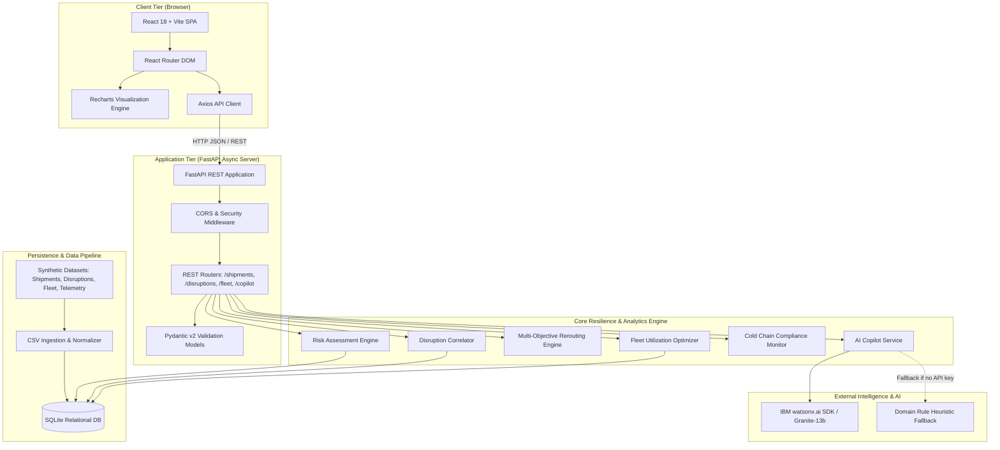

# System Architecture: ChainGuard AI

## Overview

ChainGuard AI follows a modern, decoupled client-server architecture designed for high throughput, low latency, and operational resilience. The system integrates a reactive single-page frontend with an asynchronous Python backend, backing analytics via an optimized relational SQLite data layer and AI reasoning via IBM watsonx.ai.

---

## System Architecture Diagram



---

## Component Breakdown

| Component | Technology | Responsibility |
| :--- | :--- | :--- |
| **Frontend UI** | React 18, Vite, Vanilla CSS + Tailwind tokens | High-performance glassmorphic UI, responsive navigation, simulation triggers, telemetry visualizer. |
| **Data Visualization** | Recharts, Lucide React | Cold-chain telemetry charts, fleet utilization gauges, risk distribution visuals. |
| **Backend REST API** | FastAPI, Uvicorn, Python 3.10+ | High-throughput asynchronous REST API endpoints, automated OpenAPI specification (`/docs`). |
| **Data Validation** | Pydantic v2 | Strict schema validation for incoming queries, simulation events, and structured responses. |
| **Disruption Engine** | Python (Spatial & Corridor Matching) | Geospatial and lane-level matching of active maritime/ground hazards to in-transit shipments. |
| **Rerouting Engine** | Python (Pareto Multi-Objective Scorer) | Evaluates cost, transit time delay, composite risk score, and carbon footprint for multi-modal alternatives. |
| **Fleet Optimizer** | Python (Capacity & Allocation Algorithms) | Analyzes vehicle status, utilization percentages, idle hours, and regional depot absorption. |
| **Cold-Chain Guard** | Python (Time-series threshold detection) | Detects temperature deviations from acceptable ranges (e.g. 2°C–8°C), evaluates excursion duration. |
| **AI Copilot** | `ibm-watsonx-ai` + Fallback Logic | Formulates operational recommendations, answers logistics questions, suggests mitigation playbooks. |
| **Persistence** | SQLite 3 | Embedded zero-configuration SQL database with schema foreign keys, indices, and auto-seeding. |

---

## Data Flow Pipeline

```
1. INGESTION & NORMALIZATION:
   Raw shipment records, disruption feeds, fleet telematics, and sensor readings are ingested 
   and normalized into relational SQLite tables (shipments, disruptions, fleet_assets, sensor_logs).

2. DISRUPTION CORRELATION:
   When active disruptions change (or when a user simulates a disruption), the correlation engine
   joins disruptions with active shipments matching the corridor, origin, or destination.
   Affected shipments are flagged with severity levels (Critical, High, Medium).

3. REROUTING ALTERNATIVE EVALUATION:
   For every affected shipment, the Multi-Objective Rerouting Engine calculates:
   - Alternative carriers & routes (Air Express, Rail Landbridge, Alternate Ocean)
   - Cost variance (Delta in USD)
   - ETA variance (Delay in days or hours)
   - Environmental footprint (CO2 emissions in kg)
   - Risk Index (0 - 100 based on weather, congestion, carrier reliability)

4. FLEET ABSORPTION SCAN:
   The system queries idle fleet assets (reefer trucks, dry vans) in the vicinity of affected hubs.
   Vehicles with <50% load factor or idle status are recommended for absorption.

5. PRESENTATION & INTERACTION:
   Aggregated metrics and recommendations are pushed via REST to the React client.
   Users can simulate disruption impacts, approve reroutes, inspect cold-chain alerts,
   or converse with the watsonx.ai Copilot for guided resolution.
```

---

## Security Considerations

- **Secret Management**: API keys (`WATSONX_APIKEY`, `WATSONX_PROJECT_ID`) and environment settings are managed through `.env` files and validated with `pydantic-settings`. Secrets are excluded from version control via `.gitignore`.
- **CORS Protection**: FastAPI CORS middleware is explicitly configured for frontend origin access.
- **Data Validation & Sanitization**: Strict input validation using Pydantic models prevents SQL injection and malformed payload exploits.
- **Fail-Safe Operation**: Dual AI architecture guarantees zero downtime even during third-party API outages or missing credentials.

---

## Scalability & Production Roadmap

- **Streaming Architecture**: In enterprise deployments, batch ingestion would be replaced with an Apache Kafka or IBM Event Streams pipeline consuming live AIS satellite telemetry and IoT MQTT messages.
- **Distributed Database**: Seamless migration path from SQLite to PostgreSQL with TimescaleDB extension for billion-row IoT sensor telemetry.
- **Containerization & Cloud Native**: Dockerfiles and Kubernetes / OpenShift manifests enable horizontal autoscaling of stateless FastAPI pods behind an NGINX ingress controller.
- **Model Fine-Tuning**: Integration with IBM watsonx.governance for model monitoring, drift detection, and compliance auditing.
