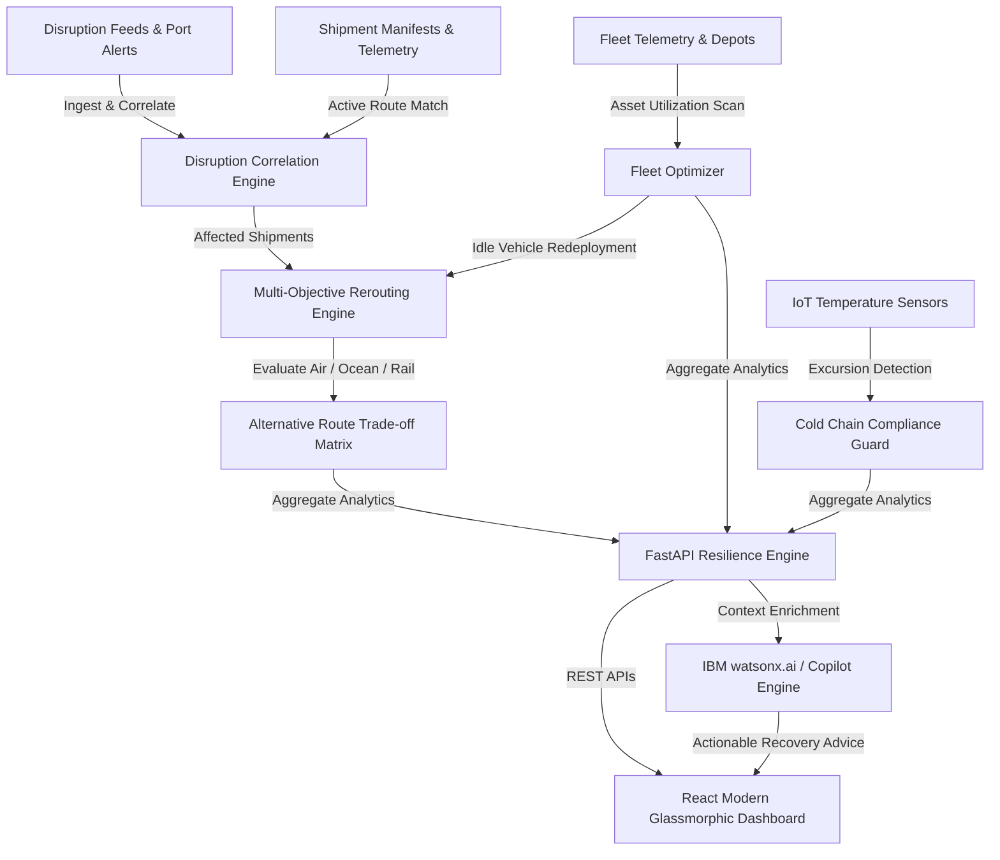

# Solution Overview: Supply Guard AI

## What We Built

**Supply Guard AI** is an intelligent, autonomous Supply Chain Control Tower and Fleet Utilization Optimizer designed for enterprise logistics managers, freight forwarders, and dispatchers. 

Supply Guard AI transforms reactive supply chain firefighting into proactive resilience by:
1. **Detecting & Correlating Disruptions in Real Time**: Continuously mapping active port strikes, canal chokepoints, severe storms, and geopolitical conflicts against active freight corridors.
2. **Generating Multi-Carrier Rerouting Recommendations**: Providing ranked alternative routes with an objective scoring algorithm comparing Cost, Delay, Risk, and CO2 emissions.
3. **Optimizing Fleet Vehicle Utilization**: Identifying idle capacity, calculating re-allocation potential, and minimizing empty miles.
4. **Guarding Cold-Chain Cargo**: Monitoring IoT telemetry (temperature, humidity, battery) in real time to prevent perishable and biopharma loss.
5. **Empowering Operators with an AI Copilot**: Integrating IBM watsonx.ai foundation models with our domain-specific supply chain knowledge graph to offer conversational guidance and concrete execution actions.

---

## How It Works

### Operational Workflow: Step-by-Step

1. **Continuous Correlation**: The engine maps active disruptions across global transit zones (e.g., Red Sea, Port of Rotterdam, Panama Canal) against in-transit shipments based on origin, destination, transit mode, and coordinates.
2. **Impact & Risk Scoring**: Affected shipments receive composite risk scores derived from cargo value, delay sensitivity, disruption severity, and temperature criticality.
3. **Automated Alternative Generation**: For every impacted shipment, the recommendation engine computes up to 3 distinct alternatives (e.g., Express Air Freight, Intermodal Rail, Alternate Ocean Carrier around Cape of Good Hope).
4. **Trade-off Calculation**: Each alternative is scored across four core dimensions:
   - **Cost Delta ($)**: Additional or saved freight expenditure.
   - **Delay Impact (Days)**: Projected variance against initial promised SLA delivery date.
   - **Risk Index (0-100)**: Probability of subsequent bottlenecks or route hazards.
   - **CO2 Impact (kg)**: Carbon footprint variance enabling ESG reporting.
5. **Fleet Absorption**: Dispatchers can cross-reference internal idle fleet assets (e.g., reefer trucks or tractor units) within proximity to absorb incoming diverted shipments, reducing third-party spot freight costs.
6. **Executive & Operational AI Assistance**: Operators interact directly with the watsonx.ai copilot, asking operational questions (e.g., *"What should I do about shipment SHP-104?"*) and receiving immediate structured playbooks with trade-off justification.

---

## Key Design Decisions

| Decision | Alternative Considered | Rationale |
| :--- | :--- | :--- |
| **FastAPI + Asynchronous Python Backend** | Flask / Django | High performance, native Pydantic validation, automatic OpenAPI / Swagger interactive documentation, and clean async integration with LLM APIs. |
| **Multi-Objective Pareto Trade-off Scoring** | Single Cost-Minimization | Real supply chains cannot optimize solely on cost: a pharma shipment prioritizes cold-chain security and time, whereas bulk dry goods prioritize cost and carbon impact. |
| **Dual AI Strategy (watsonx.ai + Heuristic Fallback)** | Cloud-only LLM or purely static rules | Ensures 100% operational resilience: if external API keys or networks are offline, the local expert rule engine immediately provides zero-downtime actionable recommendations. |
| **Modern React + Vite + Custom Design System** | Generic UI Kit / Bootstrap | Provides a stunning, high-contrast dark control tower UI with instant visual hierarchy, glassmorphism, responsive Recharts telemetry visualization, and low latency. |
| **In-Memory SQLite with Relational Normalization** | Raw JSON files | Allows real-time SQL aggregation, complex joins between shipments, disruptions, and fleet tables, and seamless one-click seed database recreation. |

---

## IBM Technologies Used

### 1. IBM watsonx.ai (`ibm/granite-13b-instruct-v2` / `meta-llama/llama-3-70b-instruct`)
- **How it is used**: Supply Guard AI utilizes the watsonx.ai Python SDK (`ibm-watsonx-ai`) to orchestrate enterprise-grade generative intelligence. When an operator queries the Copilot, the backend gathers relevant live system context (affected shipments, available fleet units, active route hazards) and prompts watsonx foundation models with structured domain guidelines.
- **Output**: Generates clear, executive-grade operational summaries, recovery playbooks, risk trade-offs, and structured operational next steps.

### 2. IBM Bob AI Innovation Hackathon Tooling
- **How it is used**: Rapid end-to-end scaffolding, architecture validation, and full-stack component synthesis adhering strictly to the official IBM Bobathon submission criteria and repository layout.
